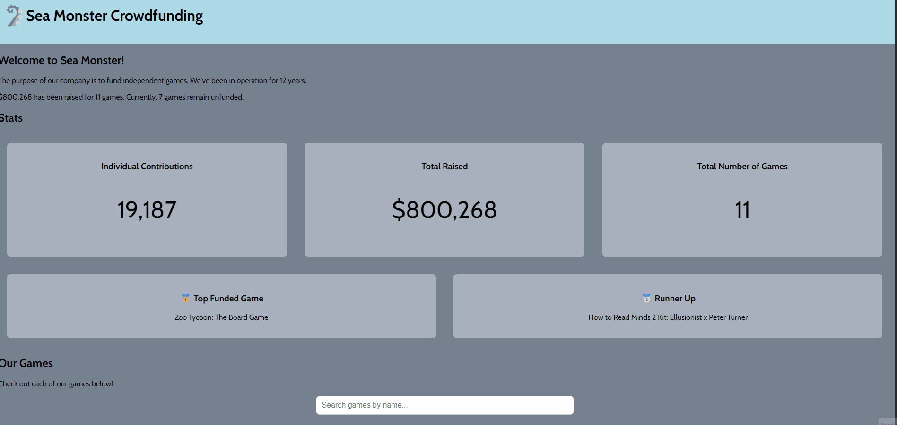

# WEB102 Prework - Sea Monster Funded Games Showcase

Submitted by: Gin Tung

Sea Monster Funded Games Showcase is a website for the company Sea Monster Crowdfunding that displays information about the games they have funded.

Time spent: 3.00 hours spent in total

## Required Features

The following **required** functionality is completed:

* [X] The introduction section explains the background of the company and how many games remain unfunded.
* [X] The Stats section includes information about the total contributions and dollars raised as well as the top two most funded games.
* [X] The Our Games section initially displays all games funded by Sea Monster Crowdfunding
* [X] The Our Games section has three buttons that allow the user to display only unfunded games, only funded games, or all games.

The following **optional** features are implemented:

* [X] List anything else that you can get done to improve the app functionality!
Implement a Search Feacture that allow to search game funded by name.

## Video Walkthrough

Here's a walkthrough of implemented features:

## Notes

While building the Sea Monster Crowdfunding app, one of the main challenges was correctly loading and managing JavaScript modules, especially when using type="module" in the script tag. Initially, the site did not display any data because the JavaScript file failed to load when the page was opened directly instead of through a local server. This required using Live Server to properly run the project.

Another challenge was debugging JavaScript errors caused by duplicate variable declarations and ensuring functions were defined and called in the correct order. Small mistakes like redeclaring variables or missing a closing brace caused the entire script to stop executing, which made troubleshooting important.

Finally, implementing dynamic DOM updates—such as filtering games and updating statistics—required careful use of array methods like filter and reduce, as well as ensuring the DOM was cleared before re-rendering content. These challenges helped reinforce the importance of clean structure, debugging tools, and step-by-step testing when building interactive web applications.

## License

    Copyright [2026] [GinTung]

    Licensed under the Apache License, Version 2.0 (the "License");
    you may not use this file except in compliance with the License.
    You may obtain a copy of the License at

        http://www.apache.org/licenses/LICENSE-2.0

    Unless required by applicable law or agreed to in writing, software
    distributed under the License is distributed on an "AS IS" BASIS,
    WITHOUT WARRANTIES OR CONDITIONS OF ANY KIND, either express or implied.
    See the License for the specific language governing permissions and
    limitations under the License.
